# 🌟 Awesome Causal AI
### *The Ultimate Compendium for Causal Intelligence & Reasoning*

  

---

### 🎯 *"From Correlation to Causation: Decoding the Why Behind AI"*

**The most comprehensive collection of Causal AI resources**  
*Meticulously curated by researchers, for researchers*

[📚 Explore Resources](#-github-repositories) • [🤝 Contribute](CONTRIBUTING.md) • [📧 Contact](#-author--maintainer) • [⭐ Star to Bookmark](https://github.com/pozapas/awesome-causal-ai)

---

## 🚀 **Quick Start**

```mermaid
graph TD
    A[🔍 Interested in Causal AI?] --> B{What's your goal?}
    B -->|Research| C[📚 Browse Papers & Surveys]
    B -->|Implementation| D[🛠️ Explore GitHub Repos]
    B -->|Learning| E[📖 Check Educational Resources]
    C --> F[🎯 Find your domain]
    D --> F
    E --> F
    F --> G[🌟 Start Contributing!]
```

## 🏆 **Featured Highlights**

📊 <strong>Repository Statistics</strong>

- **🔗 GitHub Repositories**: 1,000+ (sorted by popularity)
- **📄 Research Papers**: 100+ (latest from ArXiv)
- **⭐ Combined Stars**: 50,000+ across all repositories
- **🔄 Last Updated**: September 5, 2025

<table>
<tr>
<td width="33%">

### 🥇 **Top Libraries**
- **[causalml](https://github.com/uber/causalml)** 
  - 5,568 ⭐ | Uber's production-ready causal ML
- **[EconML](https://github.com/py-why/EconML)**
  - 4,272 ⭐ | Microsoft's causal inference toolkit
- **[awesome-causality-algorithms](https://github.com/rguo12/awesome-causality-algorithms)**
  - 3,183 ⭐ | Comprehensive algorithm index

</td>
<td width="33%">

### 🎓 **Learning Path**
1. **Beginner**: Start with survey papers
2. **Intermediate**: Explore core libraries
3. **Advanced**: Dive into latest research
4. **Expert**: Contribute to open source
5. **Master**: Publish your own work

</td>
</tr>
</table>

## 💡 **Why Causal AI Matters**

🔍 Traditional ML: "What will happen?"

🎯 Causal AI: "What if we intervene? Why did it happen?"

🏥 Healthcare → Personalized treatments

💰 Economics → Policy impact analysis  

🤖 Robotics → Understanding cause-effect

🔬 Science → Discovering mechanisms

---

## 🚀 GitHub Repositories

- **[causalml](https://github.com/uber/causalml)** (5568 ⭐) - Uplift modeling and causal inference with machine learning algorithms *(Python)*
- **[EconML](https://github.com/py-why/EconML)** (4272 ⭐) - EconML is a Python package for estimating heterogeneous treatment effects from observational data via machine learning. *(Jupyter Notebook)*
- **[awesome-causality-algorithms](https://github.com/rguo12/awesome-causality-algorithms)** (3183 ⭐) - An index of algorithms for learning causality with data *(Unknown)*
- **[causallib](https://github.com/BiomedSciAI/causallib)** (786 ⭐) - A Python package for modular causal inference analysis and model evaluations *(Python)*
- **[causalML](https://github.com/altdeep/causalML)** (776 ⭐) - The open source repository for the Causal Modeling in Machine Learning Workshop at Altdeep.ai @ www.altdeep.ai/courses/causalML *(Jupyter Notebook)*
- **[causal-ml](https://github.com/jvpoulos/causal-ml)** (737 ⭐) - Must-read papers and resources related to causal inference and machine (deep) learning *(Unknown)*
- **[awesome-time-series-papers](https://github.com/TSCenter/awesome-time-series-papers)** (623 ⭐) - An Awesome List of the latest time series papers and code from top AI venues. *(Unknown)*
- **[Causal_Reading_Group](https://github.com/fulifeng/Causal_Reading_Group)** (517 ⭐) - We will keep updating the paper list about machine learning + causal theory. We also internally discuss related papers between NExT++ (NUS) and LDS (USTC) by week. *(Unknown)*
- **[arXausality](https://github.com/logangraham/arXausality)** (416 ⭐) - A every-so-often-updated collection of every causality + machine learning paper submitted to arXiv in the recent past. *(Python)*
- **[CEVAE](https://github.com/AMLab-Amsterdam/CEVAE)** (345 ⭐) - Causal Effect Inference with Deep Latent-Variable Models *(Python)*
- **[Deep-Learning-for-Causal-Inference](https://github.com/kochbj/Deep-Learning-for-Causal-Inference)** (336 ⭐) - Extensive tutorials for learning how to build deep learning models for causal inference (HTE) using selection on observables in Tensorflow 2 and Pytorch. *(Unknown)*
- **[irl-maxent](https://github.com/qzed/irl-maxent)** (294 ⭐) - Maximum Entropy and Maximum Causal Entropy Inverse Reinforcement Learning Implementation in Python *(Jupyter Notebook)*
- **[deepscm](https://github.com/biomedia-mira/deepscm)** (287 ⭐) - Repository for Deep Structural Causal Models for Tractable Counterfactual Inference *(Jupyter Notebook)*
- **[causalML-teaching](https://github.com/MCKnaus/causalML-teaching)** (260 ⭐) - This repository consolidates my teaching material for "Causal Machine Learning". *(HTML)*
- **[Computational-Social-Science-Training-Program](https://github.com/dlab-berkeley/Computational-Social-Science-Training-Program)** (251 ⭐) - This repo contains all of the materials for Sociology 273, Computational Social Science Parts A/B. Designed as part of Berkeley's Computational Social Science Training Program. *(Jupyter Notebook)*
- **[STream3R](https://github.com/NIRVANALAN/STream3R)** (233 ⭐) - Dynamic 3D Foundation Model using Causal Transformer *(Python)*
- **[Machine-Learning](https://github.com/Mixtape-Sessions/Machine-Learning)** (208 ⭐) - Machine Learning and Causal Inference taught by Brigham Frandsen *(Jupyter Notebook)*
- **[robustdg](https://github.com/microsoft/robustdg)** (175 ⭐) - Toolkit for building machine learning models that generalize to unseen domains and are robust to privacy and other attacks.  *(Python)*
- **[CausalTransformer](https://github.com/Valentyn1997/CausalTransformer)** (154 ⭐) - Code for the paper "Causal Transformer for Estimating Counterfactual Outcomes" *(Python)*
- **[Awesome-Uplift-Model](https://github.com/JackHCC/Awesome-Uplift-Model)** (145 ⭐) - How to Apply Causal ML to Real Scene Modeling？How to learn Causal ML？*(Jupyter Notebook)*
- **[causality](https://github.com/AlxndrMlk/causality)** (143 ⭐) - Notes, exercises and other materials related to causal inference, causal discovery and causal ML. *(Jupyter Notebook)*
- **[cxplain](https://github.com/d909b/cxplain)** (131 ⭐) - Causal Explanation (CXPlain) is a method for explaining the predictions of any machine-learning model. *(Python)*
- **[csle](https://github.com/Limmen/csle)** (130 ⭐) - A research platform to develop automated security policies using quantitative methods, e.g., optimal control, computational game theory, reinforcement learning, optimization, evolutionary methods, and causal inference. *(Python)*
- **[MetricsMLNotebooks](https://github.com/CausalAIBook/MetricsMLNotebooks)** (128 ⭐) - Notebooks for Applied Causal Inference Powered by ML and AI *(Jupyter Notebook)*
- **[awesome-marketing-machine-learning](https://github.com/station-10/awesome-marketing-machine-learning)** (118 ⭐) - A curated list of awesome machine learning libraries for marketing, including media mix models, multi touch attribution, causal inference and more *(Unknown)*
- **[Awesome-Causal-Inference](https://github.com/matthewvowels1/Awesome-Causal-Inference)** (108 ⭐) - A curated list of awesome work on causal inference, particularly in machine learning. *(Unknown)*
- **[CGNN](https://github.com/GoudetOlivier/CGNN)** (100 ⭐) - Replication code for the article "Learning Functional Causal Models with Generative Neural Networks" *(Python)*
- **[Awesome-Causal-RL](https://github.com/familyld/Awesome-Causal-RL)** (99 ⭐) - A curated list of causal reinforcement learning resources. *(Unknown)*
- **[Causality-in-Trustworthy-Machine-Learning](https://github.com/MaheepChaudhary/Causality-in-Trustworthy-Machine-Learning)** (95 ⭐) - The repository contains lists of papers on causality and how relevant techniques are being used to further enhance deep learning era computer vision solutions. *(Python)*
- **[RL-Causality](https://github.com/debmandal/RL-Causality)** (89 ⭐) - References at the Intersection of Causality and Reinforcement Learning *(Unknown)*
- **[iap-cidl](https://github.com/maxwshen/iap-cidl)** (88 ⭐) - Causal Inference & Deep Learning, MIT IAP 2018 *(Unknown)*
- **[CausalMatch](https://github.com/bytedance/CausalMatch)** (87 ⭐) - CausalMatch is a Bytedance research project aimed at integrating cutting-edge machine learning and econometrics methods to bring about automation in causal inference. *(Jupyter Notebook)*
- **[ENCO](https://github.com/phlippe/ENCO)** (85 ⭐) - Official repository of the paper "Efficient Neural Causal Discovery without Acyclicity Constraints" *(Python)*
- **[Awesome-Causality-Inspired-GNNs](https://github.com/usail-hkust/Awesome-Causality-Inspired-GNNs)** (82 ⭐) - An awesome collection of causality-inspired graph neural networks. *(Unknown)*
- **[drone_causality](https://github.com/makramchahine/drone_causality)** (80 ⭐) - Training, data processing, and analysis code used for the paper "Robust Visual Flight Navigation with Liquid Neural Networks". *(Python)*
- **[OpenASCE](https://github.com/Open-All-Scale-Causal-Engine/OpenASCE)** (77 ⭐) - OpenASCE (Open All-Scale Casual Engine) is a Python package for end-to-end large-scale causal learning. It provides causal discovery, causal effect estimation and attribution algorithms all in one package. *(Python)*
- **[causal-semantic-generative-model](https://github.com/changliu00/causal-semantic-generative-model)** (74 ⭐) - Codes for Causal Semantic Generative model (CSG), the model proposed in "Learning Causal Semantic Representation for Out-of-Distribution Prediction" (NeurIPS-21) *(Python)*
- **[shapFlex](https://github.com/nredell/shapFlex)** (74 ⭐) - An R package for computing asymmetric Shapley values to assess causality in any trained machine learning model *(R)*
- **[causal-transformer-decoder](https://github.com/alex-matton/causal-transformer-decoder)** (73 ⭐) - This repository contains the code for the causal transformer decoder, which is the autoregressive version of the Pytorch TransformerDecoder. *(Python)*
- **[ICML2021-Gem](https://github.com/wanyu-lin/ICML2021-Gem)** (68 ⭐) - Official code for the ICML 2021 paper "Generative Causal Explanations for Graph Neural Networks." *(Jupyter Notebook)*
- **[PACT](https://github.com/microsoft/PACT)** (65 ⭐) - Perception-Action Causal Transformer *(Python)*
- **[cdml-neurips2020](https://github.com/causalens/cdml-neurips2020)** (62 ⭐) - This repository captures source code and data sets for our paper at the Causal Discovery & Causality-Inspired Machine Learning Workshop at Neural I. *(Python)*
- **[causeinfer](https://github.com/andrewtavis/causeinfer)** (61 ⭐) - Machine learning based causal inference/uplift in Python *(Python)*
- **[BiLLM](https://github.com/WhereIsAI/BiLLM)** (61 ⭐) - Tool for converting LLMs from uni-directional to bi-directional by removing causal mask for tasks like classification and sentence embeddings. *(Python)*
- **[cai-causal-graph](https://github.com/causalens/cai-causal-graph)** (60 ⭐) - A Causal AI package for causal graphs. *(Python)*
- **[CMCRL](https://github.com/WissingChen/CMCRL)** (54 ⭐) - The official implementation of “Cross-Modal Causal Representation Learning for Radiology Report Generation”  *(Python)*
- **[CITRIS](https://github.com/phlippe/CITRIS)** (53 ⭐) - Code repository of the paper "CITRIS: Causal Identifiability from Temporal Intervened Sequences" and "iCITRIS: Causal Representation Learning for Instantaneous Temporal Effects" *(Python)*
- **[CausalFormer](https://github.com/lingbai-kong/CausalFormer)** (52 ⭐) - PyTorch Implementation of CausalFormer: An Interpretable Transformer for Temporal Causal Discovery *(Jupyter Notebook)*
- **[ACE](https://github.com/Piyushi-0/ACE)** (51 ⭐) - Code for our ICML '19 paper: Neural Network Attributions: A Causal Perspective. *(Jupyter Notebook)*
- **[CausalAI-Course](https://github.com/d2cml-ai/CausalAI-Course)** (45 ⭐) - Lectures and Tutorials for the Causal AI course  *(Jupyter Notebook)*
- **[Awesome-Causal-Reinforcement-Learning](https://github.com/libo-huang/Awesome-Causal-Reinforcement-Learning)** (44 ⭐) -  Official repository of "A Survey on Causal Reinforcement Learning" *(Unknown)*
- **[RUN](https://github.com/zmlin1998/RUN)** (35 ⭐) - Official repository of "Root Cause Analysis In Microservice Using Neural Granger Causal Discovery" @ AAAI 2024 *(Python)*
- **[awesome-deep-causal-learning](https://github.com/huckiyang/awesome-deep-causal-learning)** (18 ⭐) -  A curated list of awesome deep causal learning methods since 2018 *(Unknown)*
- **[awesome-Causal-RL-papers](https://github.com/945716994/awesome-Causal-RL-papers)** (18 ⭐) - Here is a list of papers related to causal reinforcement learning, and I hope you can submit relevant missing papers in the issue. *(Unknown)*
- **[TCS](https://github.com/EliotZhu/TCS)** (12 ⭐) - Causal Inference using Deep Bayesian Dynamic Survival Models *(Jupyter Notebook)*
- **[ML4C](https://github.com/microsoft/ML4C)** (12 ⭐) -  ML4C: Seeing Causality Through Latent Vicinity *(Python)*
- **[awesome-causal-learning](https://github.com/kalinlau/awesome-causal-learning)** (11 ⭐) - Causality with machine learning, topic including causal represenation learning, causal reinforcement learning *(Unknown)*
- **[Awesome-Causal-Discovery](https://github.com/CharonWangg/Awesome-Causal-Discovery)** (11 ⭐) - An awesome list of Causality and Machine Learning related papers, books and other resources. *(Unknown)*
- **[causalML](https://github.com/terebn/causalML)** (6 ⭐) - Causal random forest example *(Python)*
- **[Causal-AI-Driven-Model-for-Predicting-Telecom-Churn-and-Boosting-Retention](https://github.com/tdvinh5304/Causal-AI-Driven-Model-for-Predicting-Telecom-Churn-and-Boosting-Retention)** (1 ⭐) - This project proposes an improved churn prediction model for telecoms using Causal AI to identify root causes rather than mere correlations. It evaluates XGBoost, ANN, and DNN models, revealing key churn factors like contract type and payment method. Results show high accuracy and actionable insights to boost retention and business sustainability. *(Python)*

---

📚 <strong>Educational Resources & Personal Projects</strong> (Click to expand)

> **Note**: This section contains educational resources, tutorials, course materials, personal projects, and research implementations. While these may not be production-ready libraries, they can be valuable for learning causal AI concepts and exploring different approaches.

### 🎓 Educational & Tutorial Resources

- **[causal_ai](https://github.com/raz1470/causal_ai)** (50 ⭐) - This project introduces Causal AI and how it can drive business value. *(Jupyter Notebook)*
- **[causality-tutorials](https://github.com/vveitch/causality-tutorials)** (48 ⭐) - Short tutorials on the use of machine learning methods for causal inference *(Jupyter Notebook)*
- **[max-causal-ent-irl](https://github.com/krasheninnikov/max-causal-ent-irl)** (48 ⭐) - Maximum Causal Entropy Inverse Reinforcement Learning *(Python)*
- **[CausalMBRL](https://github.com/dido1998/CausalMBRL)** (48 ⭐) - Official data and code for our paper Systematic Evaluation of Causal Discovery in Visual Model Based Reinforcement Learning *(Python)*
- **[DisC](https://github.com/googlebaba/DisC)** (41 ⭐) - NeurIPS2022-Debiasing Graph Neural Networks via Learning Disentangled Causal Substructure *(Python)*
- **[CausalCuriosity](https://github.com/sumedh7/CausalCuriosity)** (40 ⭐) - Official implementation of Causal Curiosity: RL Agents Discovering Self-supervised Experiments for Causal Representation Learning at ICML 2021. *(Python)*
- **[AAAI2022-HCM](https://github.com/DAMO-DI-ML/AAAI2022-HCM)** (39 ⭐) - Source code of AAAI'22 paper: A Hybrid Causal Structure Learning Algorithm for Mixed-type Data *(Python)*
- **[nips-ad-placement-challenge](https://github.com/alexeygrigorev/nips-ad-placement-challenge)** (38 ⭐) - The winning solution to the Ad Placement Challenge (NIPS'17 Causal Inference and Machine Learning Workshop) *(TeX)*
- **[causalDML](https://github.com/MCKnaus/causalDML)** (36 ⭐) - Implementation of Double Machine Learning *(R)*
- **[BISCUIT](https://github.com/phlippe/BISCUIT)** (36 ⭐) - Official code of the paper "BISCUIT: Causal Representation Learning from Binary Interactions" (UAI 2023) *(Python)*
- **[leap](https://github.com/weirayao/leap)** (36 ⭐) - LEAP is a tool for discovering latent temporal causal relations with gradient-based neural network. *(Jupyter Notebook)*
- **[De-focus-Attention-Networks](https://github.com/OpenGVLab/De-focus-Attention-Networks)** (35 ⭐) - Learning 1D Causal Visual Representation with De-focus Attention Networks *(Python)*
- **[GRADER](https://github.com/GilgameshD/GRADER)** (34 ⭐) - This is the official implementation of NeurIPS 2022 paper "Generalizing Goal-Conditioned Reinforcement Learning with Variational Causal Reasoning" *(Python)*
- **[plsc-40601-CI-ML](https://github.com/UChicago-pol-methods/plsc-40601-CI-ML)** (34 ⭐) - Advanced Topics in Causal Inference course. *(TeX)*
- **[sherlock](https://github.com/Netflix/sherlock)** (32 ⭐) - R package for causal machine learning for segment discovery and analysis *(R)*
- **[Double-Debiased-Adversary](https://github.com/ByungKwanLee/Double-Debiased-Adversary)** (32 ⭐) - Official PyTorch Implementation for "Mitigating Adversarial Vulnerability through Causal Parameter Estimation by Adversarial Double Machine Learning" *(Python)*
- **[causal-mbrl](https://github.com/polixir/causal-mbrl)** (32 ⭐) - Toolkit of Causal Model-based Reinforcement Learning. *(Python)*
- **[cf-feasibility](https://github.com/divyat09/cf-feasibility)** (31 ⭐) - Code accompanying the paper "Preserving Causal Constraints in Counterfactual Explanations for Machine Learning Classifiers" *(Python)*
- **[weakly-supervised-causal-representation-learning](https://github.com/Qualcomm-AI-research/weakly-supervised-causal-representation-learning)** (31 ⭐) - This repository contains the code for the paper "*Weakly supervised causal representation learning*" by Johann Brehmer, Pim de Haan, Phillip Lippe, and Taco Cohen, published at NeurIPS 2022. *(Python)*
- **[Deep-Learning-and-Causal-Inference](https://github.com/lightlightdyy/Deep-Learning-and-Causal-Inference)** (30 ⭐) - MIT course repo. *(Unknown)*
- **[Explainable-Causal-Reinforcement-Learning](https://github.com/EaseOnway/Explainable-Causal-Reinforcement-Learning)** (30 ⭐) - Explainable Causal Reinforcement Learning with attention *(Python)*
- **[causaltriplet](https://github.com/CausalTriplet/causaltriplet)** (30 ⭐) - [CLeaR23] Causal Triplet: An Open Challenge for Intervention-centric Causal Representation Learning *(Python)*
- **[spectral-rl2](https://github.com/haotiansun14/spectral-rl2)** (28 ⭐) - Representation Learning (RepL) Methods in Reinforcement Learning and Causal Inference *(Python)*
- **[PDGrapher](https://github.com/mims-harvard/PDGrapher)** (28 ⭐) - Combinatorial prediction of therapeutic perturbations using causally-inspired neural networks *(Jupyter Notebook)*
- **[Toybox](https://github.com/toybox-rs/Toybox)** (27 ⭐) - The Machine Learning Toybox for testing the behavior of autonomous agents. *(Python)*
- **[causalglm](https://github.com/tlverse/causalglm)** (26 ⭐) - Interpretable and model-robust causal inference for heterogeneous treatment effects using generalized linear working models with targeted machine-learning *(R)*
- **[2024-causal-inference-machine-learning](https://github.com/kyunghyuncho/2024-causal-inference-machine-learning)** (25 ⭐) - This repository contains lab materials from the course "Introduction to Causal Inference in Machine Learning" from Spring 2024 at New York University. *(Jupyter Notebook)*
- **[orthoml](https://github.com/vsemenova/orthoml)** (25 ⭐) - Code associated with paper: Orthogonal Machine Learning for Demand Estimation: High-Dimensional Causal Inference in Dynamic Panels,  Semenova, Goldman, Chernozhukov, Taddy (2017) https://arxiv.org/abs/1712.09988  *(R)*
- **[CausalRepID](https://github.com/facebookresearch/CausalRepID)** (25 ⭐) - Experiments to reproduce results in Interventional Causal Representation Learning.  *(Python)*
- **[CATEs](https://github.com/MCKnaus/CATEs)** (24 ⭐) - Machine Learning Estimation of Heterogeneous Causal Effects *(R)*
- **[deep-ei](https://github.com/EI-research-group/deep-ei)** (23 ⭐) - Tools for examining the causal structure of artificial neural networks with information theory *(Jupyter Notebook)*
- **[SMLW-Causality-Tutorial](https://github.com/zecevic-matej/SMLW-Causality-Tutorial)** (22 ⭐) - Eastern European Machine Learning Summer School (EEML) Workshop Series 2022. Tutorial on Causality for the Serbian Machine Learning Workshop on Deep Learning and Reinforcement Learning. *(Jupyter Notebook)*
- **[ssl-causal](https://github.com/yi249/ssl-causal)** (22 ⭐) - Semi-Supervised Learning for Deep Causal Generative Models *(Python)*
- **[aicp](https://github.com/juangamella/aicp)** (21 ⭐) - Code to reproduce the experimental results from the paper "Active Invariant Causal Prediction: Experiment Selection Through Stability", by Juan L Gamella and Christina Heinze-Deml. *(Python)*
- **[CauseBox](https://github.com/paras2612/CauseBox)** (21 ⭐) - Causal inference is a critical task in various fields such as healthcare,economics, marketing and education. Recently, there have beensignificant advances through the application of machine learningtechniques, especially deep neural networks. Unfortunately, to-datemany of the proposed methods are evaluated on different (data,software/hardware, hyperparameter) setups and consequently it isnearly impossible to compare the efficacy of the available methodsor reproduce results presented in original research manuscripts. In this paper, we propose a causal inference toolbox (CauseBox)that addresses the aforementioned problems. At the time of thewriting, the toolbox includes seven state of the art causal inferencemethods and two benchmark datasets. By providing convenientcommand-line and GUI-based interfaces, theCauseBoxtoolboxhelps researchers fairly compare the state of the art methods intheir chosen application context against benchmark datasets. *(Python)*
- **[mlcausality](https://github.com/WojtekFulmyk/mlcausality)** (21 ⭐) - Nonlinear Granger causality using machine learning techniques *(Python)*
- **[bg_control](https://github.com/RobotPsychologist/bg_control)** (20 ⭐) - Improving short-term prandial blood glucose outcomes for people with type 1 diabetes, a complex disease that affects nearly 10 million people worldwide. We aim to leverage semi-supervised learning to identify unlabelled meals in time-series blood glucose data, develop meal-scoring functions, and explore causal machine-learning techniques. *(Jupyter Notebook)*
- **[Targeted-BEHRT](https://github.com/deepmedicine/Targeted-BEHRT)** (20 ⭐) - Targeted-BEHRT: Deep Learning for Observational Causal Inference on Longitudinal Electronic Health Records *(Python)*
- **[COR](https://github.com/Linxyhaha/COR)** (19 ⭐) - Causal Representation Learning for Out-of-Distribution Recommendation. *(Python)*
- **[CausalMIL](https://github.com/WeijiaZhang24/CausalMIL)** (19 ⭐) - Multi-Instance Causal Representation Learning *(Python)*
- **[Causal-Inference-on-Networked-Data](https://github.com/songjiang0909/Causal-Inference-on-Networked-Data)** (19 ⭐) - Code for paper "Estimating Causal Effects on Networked Observational Data via Representation Learning" *(Python)*
- **[causaldiscovery-latent-interventions](https://github.com/goncalorafaria/causaldiscovery-latent-interventions)** (19 ⭐) - Method based on neural networks and variational inference for causal discovery under latent interventions, i. e. learning a shared causal graph among a infinite mixture (under a Dirichlet process prior) of intervention structural causal models . *(Python)*
- **[pypsps](https://github.com/gmgeorg/pypsps)** (18 ⭐) - Predictive State Propensity Subclassification (PSPS): A causal deep learning algoritm in TensorFlow keras  *(Jupyter Notebook)*
- **[MolReactGen](https://github.com/hogru/MolReactGen)** (17 ⭐) - Auto-regressive causal language model for molecule (SMILES) and reaction template (SMARTS) generation based on the Hugging Face implementation of OpenAI's GPT-2 transformer decoder model  *(Jupyter Notebook)*
- **[SPACE](https://github.com/jiafei1224/SPACE)** (16 ⭐) - This repository contains the source codes for the paper: "SPACE: A Simulator for Physical Interactions and Causal Learning in 3D Environments" published at ICCV 2021, 1st SEAI Workshop. *(Python)*
- **[14.388_py](https://github.com/d2cml-ai/14.388_py)** (16 ⭐) - This material has been created based on the tutorials of the course 14.388 Inference on Causal and Structural Parameters Using ML and AI in the Department of Economics at MIT taught by Professor Victor Chernozukhov. All the scripts were in R and we decided to translate them into Python, so students can manage both programing languages. Jannis Kueck and V. Chernozukhov have also published the original R Codes in Kaggle. In adition, we included tutorials on Heterogenous Treatment Effects Using Causal Trees and Causal Forest from Susan Athey’s Machine Learning and Causal Inference course. We aim to add more empirical examples were the ML and CI tools can be applied using both programming languages. *(Jupyter Notebook)*
- **[CausalBandits](https://github.com/nanavatirutu/CausalBandits)** (16 ⭐) - Project on Causal Machine learning CS 7290 *(Python)*
- **[ccbo](https://github.com/google-deepmind/ccbo)** (16 ⭐) - This repo contains the code associated to the paper:  "Constrained Causal Bayesian Optimization" by Aglietti Virginia, Alan Malek, Ira Ktena, and Silvia Chiappa. International Conference on Machine Learning. PMLR, 2023. *(Python)*
- **[Fine-Grained-Causal-RL](https://github.com/iwhwang/Fine-Grained-Causal-RL)** (16 ⭐) - Fine-Grained Causal Dynamics Learning with Quantization for Improving Robustness in Reinforcement Learning (ICML 2024) *(Python)*

### 👤 Personal Projects & Implementations

- **[Causal-U-Net](https://github.com/YangangCao/Causal-U-Net)** (38 ⭐) - unofficial PyTorch implementation of 《A Causal U-net based Neural Beamforming Network for Real-Time Multi-Channel Speech Enhancement》 *(Python)*
- **[CauAIN](https://github.com/circle-hit/CauAIN)** (22 ⭐) - Code for IJCAI 2022 accepted paper titled "CauAIN: Causal Aware Interaction Network for Emotion Recognition in Conversations" *(Python)*
- **[cfrnet-reproduction](https://github.com/aaronwtr/cfrnet-reproduction)** (18 ⭐) - Reproducing Shalit et al.'s Individual Treatment Effect model. This is a deep neural net that can be applied to various problems in causal inference. *(Python)*
- **[gnn-causality-research](https://github.com/alphanome-ai/gnn-causality-research)** (16 ⭐) - Exploring Causal Inferences in Finance with Graph Neural Networks *(Unknown)*
- **[EXPLAIGNN](https://github.com/PhilippChr/EXPLAIGNN)** (14 ⭐) - Code for our SIGIR 2023 paper. EXPLAIGNN provides a pipeline for conversational question answering (ConvQA) over heterogeneous sources, and code for iterative graph neural networks (GNNs). Such iterative GNNs can help to causally explaignn GNN outputs. *(Python)*
- **[causal_nets](https://github.com/PopovicMilica/causal_nets)** (13 ⭐) - Implementation of neural network algorithm for estimation of heterogeneous treatment effects and propensity scores described in Farrell, Liang, and Misra (2021) *(Python)*
- **[VCIN](https://github.com/LivXue/VCIN)** (12 ⭐) - Authors's code for "Variational Causal Inference Network for Explanatory Visual Question Answering" and "Integrating Neural-Symbolic Reasoning with Variational Causal Inference Network for Explanatory Visual Question Answering" *(Python)*
- **[UNet-MISO](https://github.com/Honee-W/UNet-MISO)** (10 ⭐) - unofficial implementation of "A Causal U-net based Neural Beamforming Network for Real-Time Multi-Channel Speech Enhancement" *(Python)*
- **[swap-graphs](https://github.com/aVariengien/swap-graphs)** (8 ⭐) - An implementation of input swap graphs. A tool to discover the role of neural network components with causal interventions. *(Python)*
- **[nanoDPO](https://github.com/jamesliu/nanoDPO)** (6 ⭐) - A nimble and innovative implementation of the Direct Preference Optimization (DPO) algorithm with Causal Transformer and  LSTM model, inspired by the paper of DPO in fine-tuning unsupervised Language Models *(Python)*
- **[Aitia](https://github.com/asu-crypto/Aitia)** (5 ⭐) - Implementation of the paper "Aitia: Efficient Secure Computation for Causal Discovery *(Python)*
- **[Causal_CNN](https://github.com/stat4reg/Causal_CNN)** (3 ⭐) - This repository includes supplementary material to the manuscript Ghasempour, Moosavi and de Luna (2023, Convolutional neural networks for valid and efficient causal inference). *(Unknown)*
- **[CCD_MLIC](https://github.com/yu-gi-oh-leilei/CCD_MLIC)** (2 ⭐) - Unofficial PyTorch implementation of the paper "Contextual Debiasing for Visual Recognition with Causal Mechanisms" *(Python)*
- **[Bias_AIPW](https://github.com/IngWae/Bias_AIPW)** (1 ⭐) - Accompanying material to Model misspecification and bias for inverse probability weighting estimators of average causal effects *(R)*
- **[paper_ai_agent_safety](https://github.com/SIntel423/paper_ai_agent_safety)** (1 ⭐) - This repository provides an implementation of our paper Causal Analysis of Agent Behavior for AI Safety. *(Python)*
- **[CausalML](https://github.com/yongkaiwu/CausalML)** (1 ⭐) - This is a collection of papers related to causality.  *(HTML)*
- **[paper_CEE-efficient-ML](https://github.com/tqian/paper_CEE-efficient-ML)** (1 ⭐) - Code for paper "Efficient and Globally Robust Causal Excursion Effect Estimation" by Zhaoxi Cheng, Lauren Bell, Tianchen Qian *(R)*
- **[causal-conjugation](https://github.com/yidinghao/causal-conjugation)** (1 ⭐) - Code for the paper "Verb Conjugation in Transformers Is Determined by Linear Encodings of Subject Number" in EMNLP Findings 2023. *(Python)*
- **[causality](https://github.com/uoestermeier/causality)** (0 ⭐) - A Streamlit app documenting attempts to simulate phenomenal causality with AI methods. *(HTML)*
- **[causality](https://github.com/red-gold/causality)** (0 ⭐) - causality framework for building isomorphic neural net based machine learning service *(JavaScript)*

### 🔬 Research & Experimental Projects

- **[aipwML](https://github.com/apoorvalal/aipwML)** (5 ⭐) - Regression adjustment, IPW, and AIPW estimators for causal effects using various ML methods *(HTML)*
- **[spph504-007](https://github.com/ehsanx/spph504-007)** (5 ⭐) - SPPH 504 (section 007): Application of Epidemiological Methods *(HTML)*
- **[long-context-transformers](https://github.com/arnavdantuluri/long-context-transformers)** (4 ⭐) - A repository to get train transformers to access longer context for causal language models, most of these methods are still in testing. Try them out if you'd like but please lmk your results so we don't duplicate work :) *(Python)*
- **[firm-network](https://github.com/marcaureledivernois/firm-network)** (3 ⭐) - Source code, data and plots for our paper "Analysis of Large Market Data Using Neural Networks: A Causal Approach" *(Python)*
- **[AGI-Alignment-and-Safety-Research](https://github.com/meghoward/AGI-Alignment-and-Safety-Research)** (1 ⭐) - Investigating AGI alignment, safety, and ethical considerations in AI systems through causal reasoning, red-teaming prompts, and fairness evaluations across large language models (LLMs). *(Python)*
- **[transformer-fault-diagnosis](https://github.com/yhtang714/transformer-fault-diagnosis)** (1 ⭐) - Causal NOTEARS method with counterfactual inference *(Python)*

## 📚 Research Papers

- **[Position: Causal Machine Learning Requires Rigorous Synthetic Experiments for Broader Adoption](http://arxiv.org/abs/2508.08883v1)** - Audrey Poinsot, Panayiotis Panayiotou, Alessandro Leite, et al. (2025-08)
- **[What if? Causal Machine Learning in Supply Chain Risk Management](http://arxiv.org/abs/2408.13556v1)** - Mateusz Wyrembek, George Baryannis, Alexandra Brintrup (2024-08)
- **[Causal Machine Learning: A Survey and Open Problems](http://arxiv.org/abs/2206.15475v2)** - Jean Kaddour, Aengus Lynch, Qi Liu, et al. (2022-06)
- **[The impact of extracurricular education on socioeconomic mobility in Japan: an application of causal machine learning](http://arxiv.org/abs/2506.07421v1)** - Yang Qiang (2025-06)
- **[Wind Estimation in Unmanned Aerial Vehicles with Causal Machine Learning](http://arxiv.org/abs/2407.01154v1)** - Abdulaziz Alwalan, Miguel Arana-Catania (2024-07)
- **[Causal Machine Learning for Patient-Level Intraoperative Opioid Dose Prediction from Electronic Health Records](http://arxiv.org/abs/2508.09059v1)** - Jonas Valbjørn Andersena, Anders Peder Højer Karlsen, Markus Harboe Olsen, et al. (2025-08)
- **[Causal Machine Learning for Healthcare and Precision Medicine](http://arxiv.org/abs/2205.11402v2)** - Pedro Sanchez, Jeremy P. Voisey, Tian Xia, et al. (2022-05)
- **[Quantitative causality, causality-guided scientific discovery, and causal machine learning](http://arxiv.org/abs/2402.13427v1)** - X. San Liang, Dake Chen, Renhe Zhang (2024-02)
- **[Causal machine learning for predicting treatment outcomes](http://arxiv.org/abs/2410.08770v1)** - Stefan Feuerriegel, Dennis Frauen, Valentyn Melnychuk, et al. (2024-10)
- **[Correlation to Causation: A Causal Deep Learning Framework for Arctic Sea Ice Prediction](http://arxiv.org/abs/2503.02093v1)** - Emam Hossain, Muhammad Hasan Ferdous, Jianwu Wang, et al. (2025-03)
- **[Disentangling Doubt in Deep Causal AI](http://arxiv.org/abs/2507.03622v1)** - Cooper Doyle (2025-07)
- **[Causal machine learning for high-dimensional mediation analysis using interventional effects mapped to a target trial](http://arxiv.org/abs/2504.15834v1)** - Tong Chen, Stijn Vansteelandt, David Burgner, et al. (2025-04)
- **[Transparency challenges in policy evaluation with causal machine learning -- improving usability and accountability](http://arxiv.org/abs/2310.13240v2)** - Patrick Rehill, Nicholas Biddle (2023-10)
- **[Heterogeneous treatment effect estimation with high-dimensional data in public policy evaluation -- an application to the conditioning of cash transfers in Morocco using causal machine learning](http://arxiv.org/abs/2401.07075v2)** - Patrick Rehill, Nicholas Biddle (2024-01)
- **[Causal machine learning for sustainable agroecosystems](http://arxiv.org/abs/2408.13155v1)** - Vasileios Sitokonstantinou, Emiliano Díaz Salas Porras, Jordi Cerdà Bautista, et al. (2024-08)
- **[The Missing Link: Allocation Performance in Causal Machine Learning](http://arxiv.org/abs/2407.10779v1)** - Unai Fischer-Abaigar, Christoph Kern, Frauke Kreuter (2024-07)
- **[Who cuts emissions, who turns up the heat? causal machine learning estimates of energy efficiency interventions](http://arxiv.org/abs/2508.04478v1)** - Bernardino D'Amico, Francesco Pomponi, Jay H. Arehart, et al. (2025-08)
- **[Autonomous Robotic Arm Manipulation for Planetary Missions using Causal Machine Learning](http://arxiv.org/abs/2403.00470v1)** - C. McDonnell, M. Arana-Catania, S. Upadhyay (2024-03)
- **[Interpretable Deep Causal Learning for Moderation Effects](http://arxiv.org/abs/2206.10261v3)** - Alberto Caron, Gianluca Baio, Ioanna Manolopoulou (2022-06)
- **[Causal Machine Learning in IoT-based Engineering Problems: A Tool Comparison in the Case of Household Energy Consumption](http://arxiv.org/abs/2505.12147v3)** - Nikolaos-Lysias Kosioris, Sotirios Nikoletseas, Gavrilis Filios, et al. (2025-05)
- **[Causal Machine Learning Methods for Estimating Personalised Treatment Effects -- Insights on validity from two large trials](http://arxiv.org/abs/2501.04061v1)** - Hongruyu Chen, Helena Aebersold, Milo Alan Puhan, et al. (2025-01)
- **[Bridging the Gap Between Data-Driven And Theory-Driven Modelling - Leveraging Causal Machine Learning for Integrative Modelling of Dynamical Systems](http://arxiv.org/abs/2410.09516v3)** - David Zapata Gonzalez, Marcel Meyer, Oliver Mueller (2024-10)
- **[Fairness Implications of Heterogeneous Treatment Effect Estimation with Machine Learning Methods in Policy-making](http://arxiv.org/abs/2309.00805v1)** - Patrick Rehill, Nicholas Biddle (2023-09)
- **[Management Decisions in Manufacturing using Causal Machine Learning -- To Rework, or not to Rework?](http://arxiv.org/abs/2406.11308v1)** - Philipp Schwarz, Oliver Schacht, Sven Klaassen, et al. (2024-06)
- **[How causal machine learning can leverage marketing strategies: Assessing and improving the performance of a coupon campaign](http://arxiv.org/abs/2204.10820v2)** - Henrika Langen, Martin Huber (2022-04)
- **[Neyman Meets Causal Machine Learning: Experimental Evaluation of Individualized Treatment Rules](http://arxiv.org/abs/2404.17019v1)** - Michael Lingzhi Li, Kosuke Imai (2024-04)
- **[Causal machine learning for heterogeneous treatment effects in the presence of missing outcome data](http://arxiv.org/abs/2412.19711v2)** - Matthew Pryce, Karla Diaz-Ordaz, Ruth H. Keogh, et al. (2024-12)
- **[Personalizing Sustainable Agriculture with Causal Machine Learning](http://arxiv.org/abs/2211.03179v1)** - Georgios Giannarakis, Vasileios Sitokonstantinou, Roxanne Suzette Lorilla, et al. (2022-11)
- **[The heterogeneous impact of the EU-Canada agreement with causal machine learning](http://arxiv.org/abs/2407.07652v4)** - Lionel Fontagné, Francesca Micocci, Armando Rungi (2024-07)
- **[Comprehensive Causal Machine Learning](http://arxiv.org/abs/2405.10198v2)** - Michael Lechner, Jana Mareckova (2024-05)
- **[Multi-Domain Causal Representation Learning via Weak Distributional Invariances](http://arxiv.org/abs/2310.02854v3)** - Kartik Ahuja, Amin Mansouri, Yixin Wang (2023-10)
- **[From Average Effects to Targeted Assignment: A Causal Machine Learning Analysis of Swiss Active Labor Market Policies](http://arxiv.org/abs/2410.23322v2)** - Federica Mascolo, Nora Bearth, Fabian Muny, et al. (2024-10)
- **[Towards assessing agricultural land suitability with causal machine learning](http://arxiv.org/abs/2204.12956v1)** - Georgios Giannarakis, Vasileios Sitokonstantinou, Roxanne Suzette Lorilla, et al. (2022-04)
- **[Causal Machine Learning for Moderation Effects](http://arxiv.org/abs/2401.08290v3)** - Nora Bearth, Michael Lechner (2024-01)
- **[Revisiting the propensity score's central role: Towards bridging balance and efficiency in the era of causal machine learning](http://arxiv.org/abs/2208.08065v2)** - Nima S. Hejazi, Mark J. van der Laan (2022-08)
- **[Causal AI-based Root Cause Identification: Research to Practice at Scale](http://arxiv.org/abs/2502.18240v1)** - Saurabh Jha, Ameet Rahane, Laura Shwartz, et al. (2025-02)
- **[Causal Machine Learning for Cost-Effective Allocation of Development Aid](http://arxiv.org/abs/2401.16986v3)** - Milan Kuzmanovic, Dennis Frauen, Tobias Hatt, et al. (2024-01)
- **[Deep End-to-end Causal Inference](http://arxiv.org/abs/2202.02195v2)** - Tomas Geffner, Javier Antoran, Adam Foster, et al. (2022-02)
- **[Long Story Short: Omitted Variable Bias in Causal Machine Learning](http://arxiv.org/abs/2112.13398v5)** - Victor Chernozhukov, Carlos Cinelli, Whitney Newey, et al. (2021-12)
- **[Evaluation Methods and Measures for Causal Learning Algorithms](http://arxiv.org/abs/2202.02896v1)** - Lu Cheng, Ruocheng Guo, Raha Moraffah, et al. (2022-02)
- **[Quantum Entanglement as Super-Confounding: From Bell's Theorem to Robust Machine Learning](http://arxiv.org/abs/2508.19327v1)** - Pilsung Kang (2025-08)
- **[Evaluating crop rotations around the world using satellite imagery and causal machine learning](http://arxiv.org/abs/2506.02384v1)** - Dan M. Kluger, Stefania Di Tommaso, David B. Lobell (2025-06)
- **[Inferring Heterogeneous Treatment Effects of Crashes on Highway Traffic: A Doubly Robust Causal Machine Learning Approach](http://arxiv.org/abs/2401.00781v1)** - Shuang Li, Ziyuan Pu, Zhiyong Cui, et al. (2024-01)
- **[The Effects of Flipped Classrooms in Higher Education: A Causal Machine Learning Analysis](http://arxiv.org/abs/2507.10140v1)** - Daniel Czarnowske, Florian Heiss, Theresa M. A. Schmitz, et al. (2025-07)
- **[Hyperparameter Tuning for Causal Inference with Double Machine Learning: A Simulation Study](http://arxiv.org/abs/2402.04674v1)** - Philipp Bach, Oliver Schacht, Victor Chernozhukov, et al. (2024-02)
- **[Distribution-valued Causal Machine Learning: Implications of Credit on Spending Patterns](http://arxiv.org/abs/2509.03063v1)** - Cheuk Hang Leung, Yijun Li, Qi Wu (2025-09)
- **[A Novel Two-level Causal Inference Framework for On-road Vehicle Quality Issues Diagnosis](http://arxiv.org/abs/2304.04755v1)** - Qian Wang, Huanyi Shui, Thi Tu Trinh Tran, et al. (2023-03)
- **[Prescriptive maintenance with causal machine learning](http://arxiv.org/abs/2206.01562v1)** - Toon Vanderschueren, Robert Boute, Tim Verdonck, et al. (2022-06)
- **[Causality analysis of electricity market liberalization on electricity price using novel Machine Learning methods](http://arxiv.org/abs/2507.12331v1)** - Orr Shahar, Stefan Lessmann, Daniel Traian Pele (2025-07)
- **[Causal machine learning methods and use of cross-fitting in settings with high-dimensional confounding](http://arxiv.org/abs/2405.15242v3)** - Susan Ellul, Stijn Vansteelandt, John B. Carlin, et al. (2024-05)
- **[A Causal Analysis of CO2 Reduction Strategies in Electricity Markets Through Machine Learning-Driven Metalearners](http://arxiv.org/abs/2403.15499v1)** - Iman Emtiazi Naeini, Zahra Saberi, Khadijeh Hassanzadeh (2024-03)
- **[Causal machine learning for single-cell genomics](http://arxiv.org/abs/2310.14935v1)** - Alejandro Tejada-Lapuerta, Paul Bertin, Stefan Bauer, et al. (2023-10)
- **[Using GPT-4 to guide causal machine learning](http://arxiv.org/abs/2407.18607v2)** - Anthony C. Constantinou, Neville K. Kitson, Alessio Zanga (2024-07)
- **[LLM-based Agents for Automated Confounder Discovery and Subgroup Analysis in Causal Inference](http://arxiv.org/abs/2508.07221v1)** - Po-Han Lee, Yu-Cheng Lin, Chan-Tung Ku, et al. (2025-08)
- **[Interpretable Neural System Dynamics: Combining Deep Learning with System Dynamics Modeling to Support Critical Applications](http://arxiv.org/abs/2505.14428v1)** - Riccardo D'Elia (2025-05)
- **["Cause" is Mechanistic Narrative within Scientific Domains: An Ordinary Language Philosophical Critique of "Causal Machine Learning"](http://arxiv.org/abs/2501.05844v3)** - Vyacheslav Kungurtsev, Leonardo Christov Moore, Gustav Sir, et al. (2025-01)
- **[From Text to Treatment Effects: A Meta-Learning Approach to Handling Text-Based Confounding](http://arxiv.org/abs/2409.15503v3)** - Henri Arno, Paloma Rabaey, Thomas Demeester (2024-09)
- **[Nature versus nurture in galaxy formation: the effect of environment on star formation with causal machine learning](http://arxiv.org/abs/2412.02439v1)** - Sunil Mucesh, William G. Hartley, Ciarán M. Gilligan-Lee, et al. (2024-12)
- **[Instrumental Variables in Causal Inference and Machine Learning: A Survey](http://arxiv.org/abs/2212.05778v1)** - Anpeng Wu, Kun Kuang, Ruoxuan Xiong, et al. (2022-12)
- **[Fundamental Properties of Causal Entropy and Information Gain](http://arxiv.org/abs/2402.01341v2)** - Francisco N. F. Q. Simoes, Mehdi Dastani, Thijs van Ommen (2024-02)
- **[Quantum Algorithms for Causal Estimands](http://arxiv.org/abs/2505.12873v1)** - Rishi Goel, Casey R. Myers, Sally Shrapnel (2025-05)
- **[Counterfactual Realizability](http://arxiv.org/abs/2503.11870v1)** - Arvind Raghavan, Elias Bareinboim (2025-03)
- **[Demystifying Ten Big Ideas and Rules Every Fire Scientist & Engineer Should Know About Blackbox, Whitebox & Causal Artificial Intelligence](http://arxiv.org/abs/2111.13756v1)** - M. Z. Naser (2021-11)
- **[Iterative Causal Segmentation: Filling the Gap between Market Segmentation and Marketing Strategy](http://arxiv.org/abs/2405.14743v1)** - Kaihua Ding, Jingsong Cui, Mohammad Soltani, et al. (2024-05)
- **[Generalization Bounds for Causal Regression: Insights, Guarantees and Sensitivity Analysis](http://arxiv.org/abs/2405.09516v1)** - Daniel Csillag, Claudio José Struchiner, Guilherme Tegoni Goedert (2024-05)
- **[Who Increases Emergency Department Use? New Insights from the Oregon Health Insurance Experiment](http://arxiv.org/abs/2201.07072v4)** - Augustine Denteh, Helge Liebert (2022-01)
- **[Measuring Variable Importance in Heterogeneous Treatment Effects with Confidence](http://arxiv.org/abs/2408.13002v4)** - Joseph Paillard, Angel Reyero Lobo, Vitaliy Kolodyazhniy, et al. (2024-08)
- **[Climate Immobility Traps: A Household-Level Test](http://arxiv.org/abs/2403.09470v1)** - Marco Letta, Pierluigi Montalbano, Adriana Paolantonio (2024-03)
- **[Can large language models build causal graphs?](http://arxiv.org/abs/2303.05279v2)** - Stephanie Long, Tibor Schuster, Alexandre Piché (2023-03)
- **[A Causal Perspective on Loan Pricing: Investigating the Impacts of Selection Bias on Identifying Bid-Response Functions](http://arxiv.org/abs/2309.03730v1)** - Christopher Bockel-Rickermann, Sam Verboven, Tim Verdonck, et al. (2023-09)
- **[Do causal predictors generalize better to new domains?](http://arxiv.org/abs/2402.09891v2)** - Vivian Y. Nastl, Moritz Hardt (2024-02)
- **[SimBank: from Simulation to Solution in Prescriptive Process Monitoring](http://arxiv.org/abs/2506.14772v3)** - Jakob De Moor, Hans Weytjens, Johannes De Smedt, et al. (2025-03)
- **[Open problems in causal structure learning: A case study of COVID-19 in the UK](http://arxiv.org/abs/2305.03859v2)** - Anthony Constantinou, Neville K. Kitson, Yang Liu, et al. (2023-05)
- **[Policy learning for many outcomes of interest: Combining optimal policy trees with multi-objective Bayesian optimisation](http://arxiv.org/abs/2212.06312v2)** - Patrick Rehill, Nicholas Biddle (2022-12)
- **[Causal Effect Identification in Cluster DAGs](http://arxiv.org/abs/2202.12263v2)** - Tara V. Anand, Adèle H. Ribeiro, Jin Tian, et al. (2022-02)
- **[Deception by Omission: Using Adversarial Missingness to Poison Causal Structure Learning](http://arxiv.org/abs/2305.20043v1)** - Deniz Koyuncu, Alex Gittens, Bülent Yener, et al. (2023-05)
- **[A Guide to Impact Evaluation under Sample Selection and Missing Data: Teacher's Aides and Adolescent Mental Health](http://arxiv.org/abs/2308.04963v1)** - Simon Calmar Andersen, Louise Beuchert, Phillip Heiler, et al. (2023-08)
- **[Impact of Physical Activity on Quality of Life During Pregnancy: A Causal ML Approach](http://arxiv.org/abs/2402.16909v1)** - Kianoosh Kazemi, Iina Ryhtä, Iman Azimi, et al. (2024-02)
- **[Efficient Real-world Testing of Causal Decision Making via Bayesian Experimental Design for Contextual Optimisation](http://arxiv.org/abs/2207.05250v1)** - Desi R. Ivanova, Joel Jennings, Cheng Zhang, et al. (2022-07)
- **[Individualised Treatment Effects Estimation with Composite Treatments and Composite Outcomes](http://arxiv.org/abs/2502.08282v2)** - Vinod Kumar Chauhan, Lei Clifton, Gaurav Nigam, et al. (2025-02)
- **[Using uncertainty-aware machine learning models to study aerosol-cloud interactions](http://arxiv.org/abs/2301.11921v1)** - Maëlys Solal, Andrew Jesson, Yarin Gal, et al. (2022-11)
- **[CAST: Time-Varying Treatment Effects with Application to Chemotherapy and Radiotherapy on Head and Neck Squamous Cell Carcinoma](http://arxiv.org/abs/2505.06367v1)** - Everest Yang, Ria Vasishtha, Luqman K. Dad, et al. (2025-05)
- **[Optimal Treatment Allocation under Constraints](http://arxiv.org/abs/2404.18268v1)** - Torben S. D. Johansen (2024-04)
- **[Neural Bayesian Network Understudy](http://arxiv.org/abs/2211.08243v1)** - Paloma Rabaey, Cedric De Boom, Thomas Demeester (2022-11)
- **[Learning Discrete Directed Acyclic Graphs via Backpropagation](http://arxiv.org/abs/2210.15353v1)** - Andrew J. Wren, Pasquale Minervini, Luca Franceschi, et al. (2022-10)
- **[Understanding the impacts of crop diversification in the context of climate change: a machine learning approach](http://arxiv.org/abs/2307.08617v1)** - Georgios Giannarakis, Ilias Tsoumas, Stelios Neophytides, et al. (2023-07)
- **[Uplift modeling with continuous treatments: A predict-then-optimize approach](http://arxiv.org/abs/2412.09232v2)** - Simon De Vos, Christopher Bockel-Rickermann, Stefan Lessmann, et al. (2024-12)
- **[Causal Relationship Network of Risk Factors Impacting Workday Loss in Underground Coal Mines](http://arxiv.org/abs/2402.05940v1)** - Shangsi Ren, Cameron A. Beeche, Zhiyi Shi, et al. (2024-01)
- **[Mining Causality: AI-Assisted Search for Instrumental Variables](http://arxiv.org/abs/2409.14202v3)** - Sukjin Han (2024-09)
- **[Causal Analysis of the TOPCAT Trial: Spironolactone for Preserved Cardiac Function Heart Failure](http://arxiv.org/abs/2211.12983v1)** - Francesca E. D. Raimondi, Tadhg O'Keeffe, Hana Chockler, et al. (2022-11)
- **[PC-SRGAN: Physically Consistent Super-Resolution Generative Adversarial Network for General Transient Simulations](http://arxiv.org/abs/2505.06502v3)** - Md Rakibul Hasan, Pouria Behnoudfar, Dan MacKinlay, et al. (2025-05)
- **[Cause-Effect Preservation and Classification using Neurochaos Learning](http://arxiv.org/abs/2201.12181v1)** - Harikrishnan N B, Aditi Kathpalia, Nithin Nagaraj (2022-01)
- **[Identifying Causal Effects of Discrete, Ordered and ContinuousTreatments using Multiple Instrumental Variables](http://arxiv.org/abs/2311.17575v3)** - Nadja van 't Hoff (2023-11)
- **[Quantifying Aleatoric Uncertainty of the Treatment Effect: A Novel Orthogonal Learner](http://arxiv.org/abs/2411.03387v2)** - Valentyn Melnychuk, Stefan Feuerriegel, Mihaela van der Schaar (2024-11)
- **[Identifying the Causes of Pyrocumulonimbus (PyroCb)](http://arxiv.org/abs/2211.08883v3)** - Emiliano Díaz Salas-Porras, Kenza Tazi, Ashwin Braude, et al. (2022-11)
- **[Teamwork and Spillover Effects in Performance Evaluations](http://arxiv.org/abs/2403.15200v1)** - Enzo Brox, Michael Lechner (2024-03)
- **[Causally Learning an Optimal Rework Policy](http://arxiv.org/abs/2306.04223v1)** - Oliver Schacht, Sven Klaassen, Philipp Schwarz, et al. (2023-06)
- **[A churn prediction dataset from the telecom sector: a new benchmark for uplift modeling](http://arxiv.org/abs/2312.07206v1)** - Théo Verhelst, Denis Mercier, Jeevan Shrestha, et al. (2023-12)
- **[Influence of Backdoor Paths on Causal Link Prediction](http://arxiv.org/abs/2410.14680v1)** - Utkarshani Jaimini, Cory Henson, Amit Sheth (2024-09)
- **[Should I Stop or Should I Go: Early Stopping with Heterogeneous Populations](http://arxiv.org/abs/2306.11839v3)** - Hammaad Adam, Fan Yin, Huibin, et al. (2023-06)

---

## 🌐 **Join the Causal AI Community**

### 🤝 **How to Contribute**

<table>
<tr>
<td align="center" width="33%">

**🔍 Discover**
 
Find new resources, papers, or tools in Causal AI

</td>
<td align="center" width="33%">

**✨ Contribute**
 
Follow our [guidelines](CONTRIBUTING.md) and submit a PR

</td>
<td align="center" width="33%">

**🎉 Celebrate**
 
Join the acknowledgments and grow the community

</td>
</tr>
</table>

### 🎯 **Contribution Areas**

---

## 👤 **Author & Maintainer**

### **Amir Rafe**
*Texas State University, [AI in Transportation Lab](https://ait-lab.vercel.app/)*

---

### 📊 **Impact Metrics**

### 🌟 **Built with ❤️ for the Causal AI Community**
